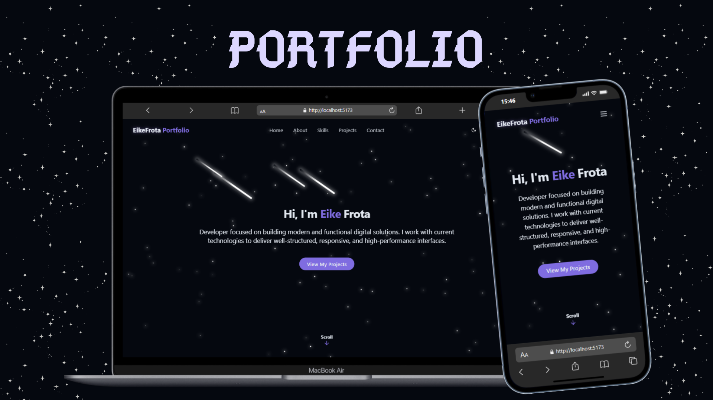

# 💼 Portfólio | Eike Frota

<p align="center">
	
</p>

Este é o meu portfólio pessoal, desenvolvido para apresentar meus principais projetos, habilidades e informações de contato. O objetivo é compartilhar minha trajetória como desenvolvedor, demonstrando meus conhecimentos em tecnologias modernas de front-end e design responsivo.

---

## 🎯 Objetivo

O portfólio tem como objetivo centralizar e destacar meus projetos, experiências e competências técnicas, facilitando o contato com recrutadores, parceiros e demais interessados no meu trabalho.

---

## 🚀 Funcionalidades

- ✅ **Página inicial com apresentação pessoal**
- 🖼️ **Seção de projetos com imagens e descrições**
- 🛠️ **Lista de habilidades técnicas**
- 🌗 **Alternância de tema (claro/escuro)**
- 🌐 **Suporte a múltiplos idiomas (PT/EN)**
- 📱 **Layout responsivo para dispositivos móveis**
- 📩 **Formulário de contato funcional**
- ✨ **Animações e efeitos visuais modernos**

---

## 🛠️ Tecnologias Utilizadas

### Front-end

- [React](https://react.dev/)
- [Vite](https://vitejs.dev/)
- [JavaScript](https://developer.mozilla.org/pt-BR/docs/Web/JavaScript)
- [CSS Modules](https://github.com/css-modules/css-modules) / [CSS3](https://developer.mozilla.org/pt-BR/docs/Web/CSS)
- [ESLint](https://eslint.org/)

### Outras Bibliotecas

- [React Icons](https://react-icons.github.io/react-icons/)
- [Vite Plugin React](https://github.com/vitejs/vite-plugin-react)
- [Toast UI](https://github.com/nhn/toast-ui.react-toastify)
- [Custom Hooks](src/hooks/)

---

## 📂 Estrutura do Projeto

```
src/
	assets/           # Imagens e ícones
	components/       # Componentes reutilizáveis (Navbar, Footer, Sections, etc)
	hooks/            # Custom hooks
	lib/              # Utilitários e traduções
	pages/            # Páginas principais (Home, NotFound)
	App.jsx           # Componente principal
	main.jsx          # Ponto de entrada da aplicação
	index.css         # Estilos globais
public/
	projects/         # Imagens dos projetos
```

---

## 🚀 Como rodar o projeto

1. **Clone o repositório:**
	 ```sh
	 git clone https://github.com/seu-usuario/seu-portfolio.git
	 ```

2. **Instale as dependências:**
	 ```sh
	 npm install
	 ```

3. **Inicie o servidor de desenvolvimento:**
	 ```sh
	 npm run dev
	 ```

4. **Acesse em:**  
	 [http://localhost:5173](http://localhost:5173)

---

## 👨‍💻 Contato

- [LinkedIn](https://www.linkedin.com/in/seu-usuario)
- [E-mail](mailto:seu-email@dominio.com)

---
